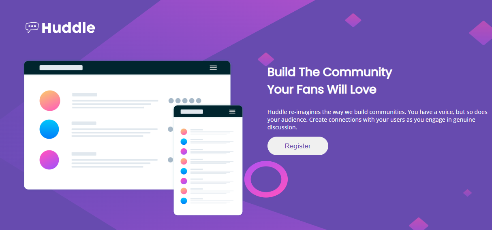

# Frontend Mentor - Huddle landing page with single introductory section solution

This is a solution to the [Huddle landing page with single introductory section challenge on Frontend Mentor](https://www.frontendmentor.io/challenges/huddle-landing-page-with-a-single-introductory-section-B_2Wvxgi0). Frontend Mentor challenges help you improve your coding skills by building realistic projects.

## Table of contents

- [Overview](#overview)
  - [The challenge](#the-challenge)
  - [Screenshot](#screenshot)
  - [Links](#links)
- [My process](#my-process)
  - [Built with](#built-with)
  - [What I learned](#what-i-learned)
- [Author](#author)

## Overview

### The challenge

Users should be able to:

- View the optimal layout for the page depending on their device's screen size
- See hover states for all interactive elements on the page


### Screenshot



### Links

- Solution URL: [SOLUTION](https://www.frontendmentor.io/solutions/responsive-huddle-landing-page-with-single-introductory-using-css-grid-fC86yh3oSH)
- Live Site URL: [LIVE SITE](https://azizp128.github.io/Huddle-Landing-Page-with-Single-Introductory/)

## My process

### Built with

- Semantic HTML5 markup
- CSS custom properties
- Flexbox
- CSS Grid
- Mobile-first workflow

### What I learned

I learned responsive design using CSS Grid in this challenge.

To see how you can add code snippets, see below:

```css
.container {
  display: grid;
  grid-template-areas:
    "header main"
    "header main";
  justify-items: center;
  align-items: center;
}

header {
  grid-area: header;
}

main {
  grid-area: main;
}
```

## Author

- Frontend Mentor - [@azizp128](https://www.frontendmentor.io/profile/azizp128)
- Twitter - [@azizprbw](https://www.twitter.com/azizprbw)
